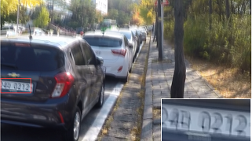
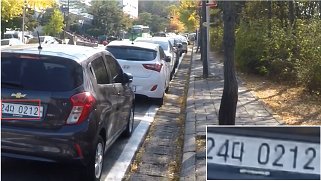
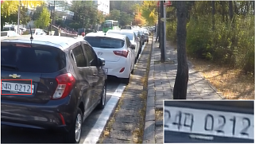
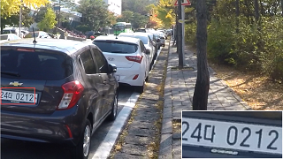

# DCTGAN-master
Code for "GAN-Based Image Deblurring Using DCT discriminator"

Takahiro Kudo, Hiroki Tomosada, Takanori Fujisawa, Masaaki Ikehara

Reviewing for IEEE Access

## Abstract
Image deblurring has been an important issue recently because of the increasing number of imaging devices and the spread of HD displays. Thus, the demand for image blurring with high accuracy has increased in the past several years. Image deblurring has two kinds of problem settings, non-blind or blind, and uniform or non-uniform deblurring. In this paper, the problem setting supposes blind and non-uniform. Recently, Convolutional Neural Network (CNN) and Generative Adversarial Network (GAN) based algorithms have been proposed for image deblurring, such as SRN, DeblurGAN, and DeblurGANv2. These conventional methods exhibit high performance in test images. However, these methods often lose the details of the restored image, and form block noise or ringing artifacts during the deblurring process. To solve these problems, we propose a method that preserves texture and suppresses ringing artifacts in the restored image, named ``DCTGAN.'' In the proposed method, we adopt the architecture of GAN because it can retain the details in the restored image. In addition, the DCT discriminator is introduced to the proposed method. It compares only the high-frequency components of the image by discrete cosine transform (DCT) of the fake image obtained by the generator and ground truth image. Hereby, DCTGAN may reduce block noise or ringing artifacts while maintaining deblurring performance. To evaluate the performance of DCTGAN, test images of GoPro Dataset and Real image dataset are used in the experiments. Both numerical and subjective results in the experiments show that DCTGAN can process while retaining the details of the restored images, and it also suppresses ringing artifacts and excessive patterns.

| Blurred | SRN | DeblurGANv2 | DCTGAN | Sharp |
| --- | --- | --- | --- | --- |
|  |  |  |  |  |

## Requirements
Pytorch(torch and torchvision)

NumPy

OpenCV(cv2)

glob

time

## The Quatation
The file "dct.py" is quated by <https://github.com/zh217/torch-dct>

## Test Datasets
The GoPro Dataset and Real image dataset can be downloaded via the links below:

[GoPro Test(Blurred)](https://drive.google.com/file/d/1rzAaZCrD5TTqtKAeskhdxuyo4CIhlR9J/view?usp=sharing)

[GoPro Test(Sharp)](https://drive.google.com/file/d/1rzAaZCrD5TTqtKAeskhdxuyo4CIhlR9J/view?usp=sharing)

[Real Test(Blurred)](https://drive.google.com/file/d/1dc9ToG-rRarge3z4j_OYAth8Q7QSKdep/view?usp=sharing)

Also, GoPro Dataset originated by "Nah et al." can be downloaded below :

[GoPro Dataset](https://github.com/SeungjunNah/DeepDeblur_release)

Moreover, originated Real image dataset can be downloaded below :

[Real image dataset](http://vllab.ucmerced.edu/wlai24/cvpr16_deblur_study/)

## Experimental Results
Experimental Results using pre-trained models in the paper can be downloaded as

[GoPro](https://drive.google.com/file/d/1XZfmWCvhaO95KjN6CTLEr1FcA1Y5SiZ8/view?usp=sharing)

[Real](https://drive.google.com/file/d/10e_XqajnQeiFlNk9o98uI8960Wzjl8EC/view?usp=sharing)

## Code for comparison by PSNR and SSIM
The code used the comparison of PSNR and SSIM in the numerical experiment is below : 

[Code for numerical experiment](https://drive.google.com/file/d/1TlV2UjN0JmwvhoqNe36CVZsexnwfT9Lh/view?usp=sharing)

## The pre-trained models
The experiment models in the paper can be downloaded via the link below:
[Models](https://drive.google.com/file/d/1EkLJWUjSmbDFuSF5U5jW3hqmLcIehL8j/view?usp=sharing)

For further information, please contact: {kudo, tomosada, ikehara}@tkhm.elec.keio.ac.jp

